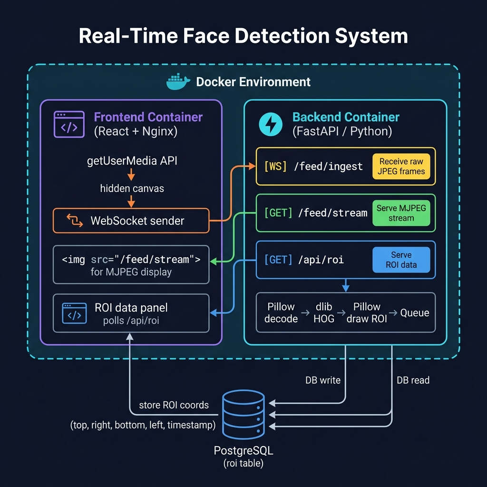

# Real-Time Face Detection Video Streaming System

A personal project I built to explore real-time video processing in the browser without using OpenCV. The system streams webcam frames to a FastAPI backend, detects faces using a lightweight ONNX model, draws bounding boxes using Pillow, and streams the annotated video back to the browser as MJPEG.



---

## What it does

- Captures webcam frames in the browser via `getUserMedia`
- Sends frames to the backend over a WebSocket connection
- Detects faces using the UltraFace ONNX model (no OpenCV, no dlib)
- Draws a bounding box around detected faces using Pillow
- Streams the annotated video back as MJPEG — displayed in a plain `` tag
- Saves face bounding box coordinates (ROI) to a database
- Shows ROI history in a table on the frontend

---

## API Endpoints

| Method | Path | Description |
|--------|------|-------------|
| `WS` | `/feed/ingest` | Receives JPEG frames from the browser |
| `GET` | `/feed/stream` | Returns the annotated MJPEG stream |
| `GET` | `/api/roi` | Returns stored ROI records |
| `GET` | `/api/roi/latest` | Returns the most recent ROI |
| `GET` | `/health` | Health check |

---

## Tech Stack

- **FastAPI** — backend framework, handles WebSocket + HTTP
- **UltraFace ONNX** — face detection model (runs via `onnxruntime`)
- **Pillow** — decoding frames and drawing bounding boxes
- **SQLAlchemy (async)** — ORM for database access
- **SQLite** (local) / **PostgreSQL** (production) — stores ROI data
- **React + Vite** — frontend
- **nginx** — serves the React build in Docker
- **Docker Compose** — runs all 3 services together

---

## Running locally

You need [Docker Desktop](https://www.docker.com/products/docker-desktop/) installed.

```bash
git clone https://github.com/Arjit2716/Real-Time-Detection-System.git
cd Real-Time-Detection-System
docker compose up --build
```

Then open:
- Frontend → http://localhost:5173
- Backend docs → http://localhost:8000/docs

First build takes a few minutes (downloads the ONNX model and installs dependencies).

---

## Deploying to Render

A `render.yaml` file is included. Just connect this repo to [Render](https://render.com) via **New → Blueprint** and it will set up the database, backend, and frontend automatically.

---

## Project Structure

```
.
├── render.yaml
├── docker-compose.yml
├── backend/
│   ├── Dockerfile
│   ├── requirements.txt
│   ├── main.py          # all 3 endpoints + MJPEG broker
│   ├── models.py        # SQLAlchemy ROI model
│   ├── database.py      # async engine setup
│   └── download_model.py
└── frontend/
    ├── Dockerfile
    ├── nginx.conf
    ├── src/
    │   ├── App.jsx      # webcam capture, WebSocket, MJPEG display
    │   └── index.css
    └── vite.config.js
```

---

## Notes

- No OpenCV anywhere — all image operations use Pillow and numpy
- The ONNX model (`version-RFB-320.onnx`) is downloaded at build time and not committed to the repo
- SQLite is used for local dev, PostgreSQL for production (controlled via `DATABASE_URL` env var)
